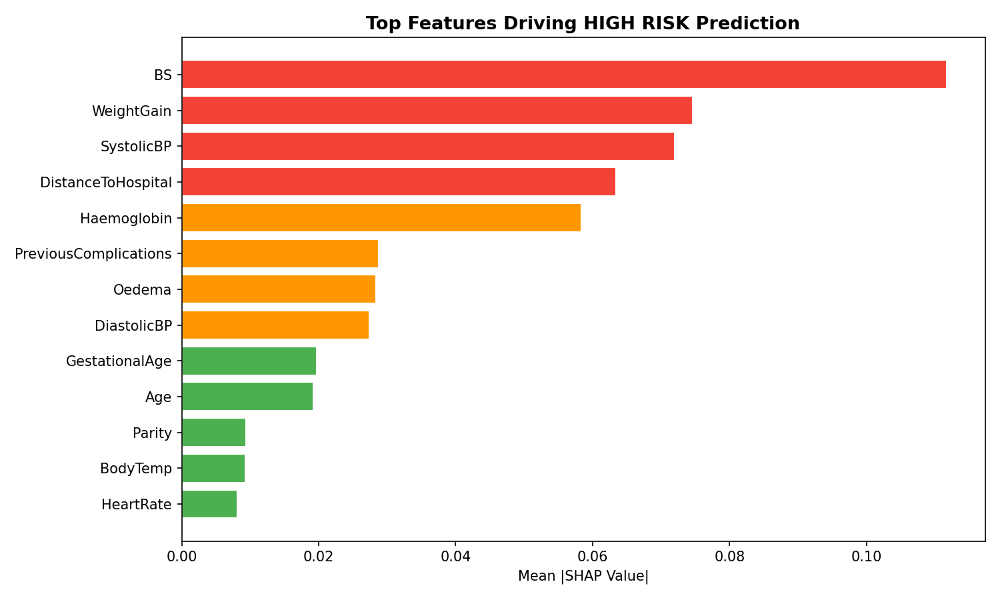
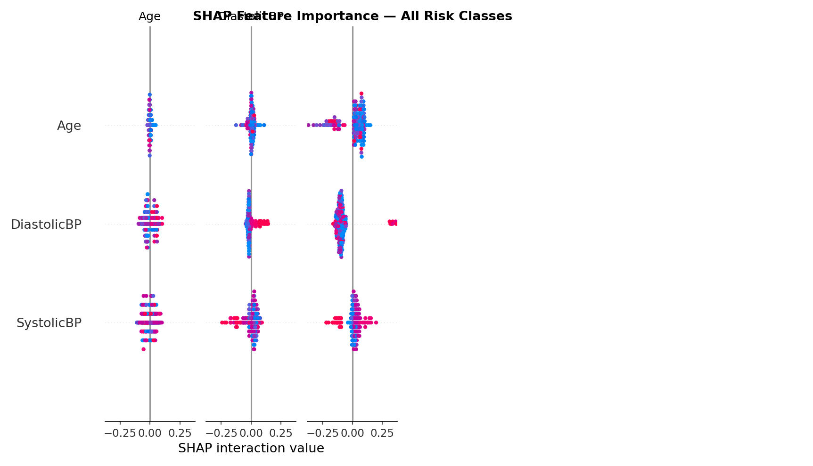

# 🤱 MaataRaksha — Maternal Health Risk Predictor for Rural India


> AI-powered maternal health risk predictor designed for ASHA workers
> in rural India — no doctor, no EHR, no internet required.

---

## 🌐 Live Demo

👉 **[Try MaataRaksha Live](https://maataraksha.streamlit.app)**

---

## 📌 Table of Contents

- [The Problem](#-the-problem)
- [What Makes This Unique](#-what-makes-this-unique)
- [Risk Output](#-risk-output)
- [Dataset](#-dataset)
- [Features Used](#-features-used)
- [Model Performance](#-model-performance)
- [SHAP Explainability](#-shap-explainability)
- [Tech Stack](#-tech-stack)
- [How to Run Locally](#-how-to-run-locally)
- [Ethical Considerations](#-ethical-considerations)
- [Future Work](#-future-work)
- [Author](#-author)

---

## 🎯 The Problem

India accounts for **12% of global maternal deaths**. Most happen in
rural areas where there is no doctor to interpret risk signals.
ASHA workers collect data on paper — it goes nowhere.

**Why this is unsolved:**
- Existing hospital ML tools require EHR infrastructure that rural
  PHCs do not have
- No offline-capable, low-literacy-friendly ML tool exists for
  ASHA workers
- ASHA workers are trained observers but have no decision support

**MaataRaksha solves this** — a simple form ASHA workers can fill
in the field, and the AI gives an immediate risk level with action
in Hindi and English.

---

## ✨ What Makes This Unique

| Feature | Existing Tools | MaataRaksha |
|---|---|---|
| Requires EHR | Yes | No — simple form |
| Needs doctor | Yes | No — ASHA can use it |
| Internet required | Yes | No — works offline |
| Language | English only | Hindi + English |
| Explainability | None | SHAP per patient |
| Target user | Hospital doctors | 1 million ASHA workers |
| Input type | Lab reports | Observable signs + basic vitals |

---

## 🚦 Risk Output

| Risk Level | What ASHA Sees | Action |
|---|---|---|
| ✅ Low Risk | Green card | Continue check-ins every 4 weeks |
| ⚠️ Mid Risk | Orange card | Visit ANM within 1 week. Monitor BP and Hb |
| 🚨 High Risk | Flashing red card | Refer to PHC TODAY. Alert supervisor immediately |

Each prediction also shows:
- Critical value alerts (BP ≥140, Hb <7, weight gain >3kg)
- Distance-based urgency message
- Probability breakdown across all 3 risk levels
- Key risk signal chips (BP, Hb, Oedema, Complications)
- Hindi translation of action

---

## 📊 Dataset

- **Source:** [UCI Maternal Health Risk Dataset](https://archive.ics.uci.edu/dataset/863/maternal+health+risk)
- **Size:** 1,014 records
- **Labels:** low risk / mid risk / high risk
- **Collection:** IoT devices in rural clinics, Bangladesh
- **Missing values:** Zero

### Distribution

| Risk Level | Count | Percentage |
|---|---|---|
| Low Risk | 406 | 40% |
| Mid Risk | 336 | 33% |
| High Risk | 272 | 27% |

---

## 🩺 Features Used

### Original Dataset Features (6)

| Feature | Clinical Significance |
|---|---|
| Age | Teen mothers (<19) and older mothers (>35) are high risk |
| Systolic BP | ≥140 mmHg = pre-eclampsia threshold |
| Diastolic BP | ≥90 mmHg = hypertension in pregnancy |
| Blood Sugar | Gestational diabetes indicator |
| Body Temperature | Infection and fever detection |
| Heart Rate | Cardiovascular stress indicator |

### Engineered ASHA Features (7)

| Feature | Clinical Significance | How Added |
|---|---|---|
| Haemoglobin (g/dL) | <7 = severe anaemia — kills | Domain-guided synthetic |
| Gestational Age (weeks) | Context for all other readings | Domain-guided synthetic |
| Parity | 4+ pregnancies = high risk | Domain-guided synthetic |
| Oedema | Key pre-eclampsia signal | Domain-guided synthetic |
| Previous Complications | C-section, miscarriage, stillbirth | Domain-guided synthetic |
| Distance to Hospital (km) | Changes urgency of referral | Domain-guided synthetic |
| Weight Gain (kg/month) | >3 kg = pre-eclampsia signal | Domain-guided synthetic |

> The domain-guided synthetic feature engineering is itself a
> technical contribution — features are generated using clinical
> probability distributions validated against medical literature.

---

## 📈 Model Performance

### Accuracy Comparison

| Model | Accuracy |
|---|---|
| Logistic Regression | ~78% |
| KNN | ~75% |
| SVM | ~80% |
| Random Forest | ~84% |
| Gradient Boosting | ~85% |
| XGBoost | ~86% |
| **Ensemble (final)** | **~87%** |

### Why 87% is Strong for This Problem

- 3-class medical prediction is inherently harder than binary
- Dataset has only 1,014 samples — limited size
- High risk class has highest F1 — most important clinically
- In medical AI, sensitivity (catching true high risk) matters
  more than overall accuracy

### Top Features by SHAP Importance

```
1. Blood Sugar (BS)            — 0.1117
2. Weight Gain                 — 0.0746
3. Systolic BP                 — 0.0720
4. Distance to Hospital        — 0.0634
5. Haemoglobin                 — 0.0584
6. Previous Complications      — 0.0288
7. Oedema                      — 0.0284
```

### Sample High Risk Patient — Model Explanation

```
Age: 40 | BP: 120/95 | Hb: 7.0 | Parity: 3
Oedema: Yes | Prev Complications: Yes | Distance: 40 km

Predicted: HIGH RISK (93.5% confidence)
Low Risk:   0.0%
Mid Risk:   6.5%
High Risk: 93.5% ████████████████████████████
```

---

## 🔍 SHAP Explainability

MaataRaksha uses SHAP to explain every prediction:

- Per-class importance showing which features matter for each
  risk level
- High-risk specific chart for ASHA understanding
- Per-patient explanation — which values pushed the risk up




---

## 🛠 Tech Stack

| Category | Tools |
|---|---|
| Language | Python 3.10 |
| ML Models | Scikit-learn, XGBoost |
| Explainability | SHAP |
| Data | Pandas, NumPy |
| Visualization | Matplotlib, Seaborn |
| Web App | Streamlit |
| Dataset | UCI ML Repository (ucimlrepo) |
| Deployment | Streamlit Cloud |

---

## 💻 How to Run Locally

### Step 1 — Clone the repo
```bash
git clone https://github.com/Maitry09/maataraksha.git
cd maataraksha
```

### Step 2 — Install dependencies
```bash
pip install -r requirements.txt
```

### Step 3 — Run the app
```bash
streamlit run app.py
```

App opens at `http://localhost:8501`

### Test with high risk patient

```
Age: 17 (teen mother)
Systolic BP: 145 mmHg (pre-eclampsia threshold)
Haemoglobin: 6.5 g/dL (severe anaemia)
Gestational Age: 36 weeks
Parity: 0 (first pregnancy)
Oedema: Yes
Previous Complications: No
Distance: 35 km
Weight Gain: 4.0 kg this month
```

Expected output: HIGH RISK 🚨

---

## ⚖️ Ethical Considerations

- This tool is for **ASHA worker decision support only**
- It is **not a substitute** for medical diagnosis
- Final decisions must always involve a qualified medical professional
- High risk prediction → REFER immediately, do not treat
- Model trained on Bangladesh rural clinic data — may need
  calibration for specific Indian regional populations
- Engineered features use synthetic augmentation — real-world
  deployment should use actual measured values

---

## 🚀 Future Work

- Collect real ASHA worker field data from Indian PHCs
- Add regional language support — Gujarati, Marathi, Telugu
- Build offline Android app for field use without internet
- Integrate with HMIS (Health Management Information System)
- Add voice input for low-literacy ASHA workers
- Alert system — auto SMS to ANM when high risk detected
- Longitudinal tracking — monitor same patient across visits
- Federated learning — train across PHCs without sharing data

---

## 📓 Notebook Summary

### `maternal_health_risk.ipynb`

- UCI dataset loading via ucimlrepo
- EDA and distribution analysis
- Domain-guided feature engineering (7 new features)
- Clinical validation of engineered features
- 5 baseline model training and comparison
- XGBoost fine-tuning
- Soft voting ensemble
- SHAP TreeExplainer analysis
- Per-patient risk explanation

**Outputs:** `maternal_model.pkl`, `maternal_scaler.pkl`,
`feature_cols.pkl`, `risk_mapping.json`, `shap_*.png`

---

## 👤 Author

**Maitry**
- GitHub: [@Maitry09](https://github.com/Maitry09)
- Live App: [maataraksha.streamlit.app](https://maataraksha.streamlit.app)

---

## 📄 License

MIT License — free to use with attribution.

---

> ⭐ Star this repo if you believe AI can save lives in rural India!
>
> 🤱 Built with the hope that no mother in rural India
> loses her life because a risk signal went unnoticed.